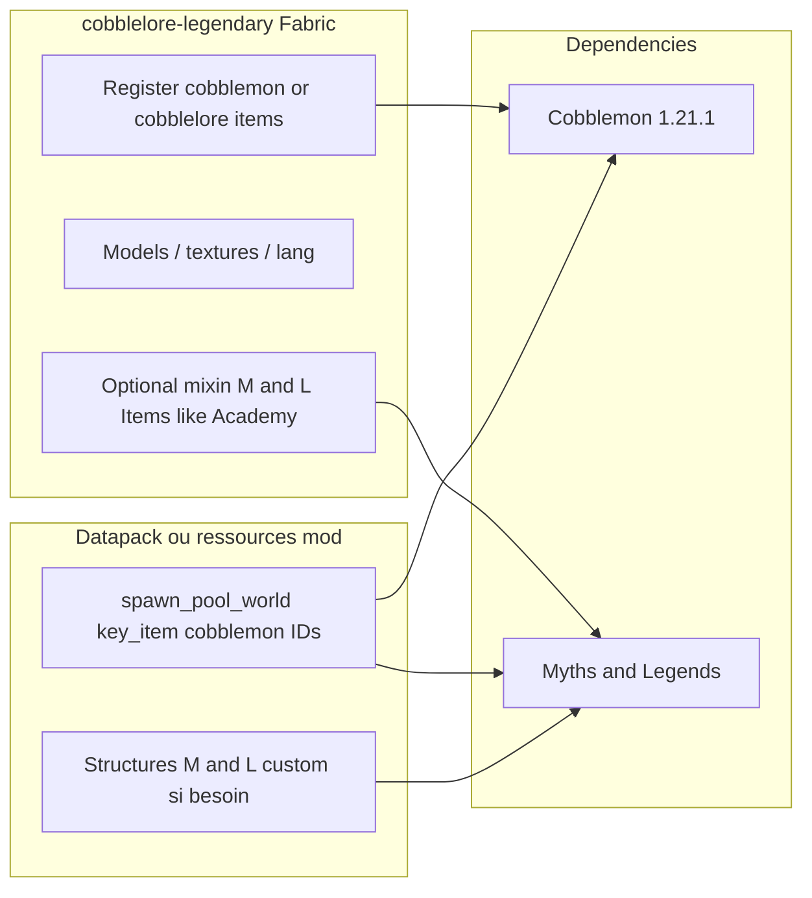

# Analyse — Cobblemon Academy Integration, Delta Client, Myths and Legends

Contexte cible : **Fabric 1.21.1**, Cobblemon ~1.7+, objectif futur **`cobblelore-legendary`** (items légendaires façon Delta/Academy + spawns via Myths and Legends).

## Sources utilisées

| Mod | Version analysée | Provenance |
|-----|------------------|------------|
| Cobblemon Academy Integration | JAR `1.4.0` (Modrinth) + source **HEAD** | [Modrinth](https://modrinth.com/mod/cobblemon-academy-integration), [StarAcademyMod](https://github.com/Abes-Hutt/StarAcademyMod) (GPL-3.0) |
| Delta Client | `5.6.2` (modpack Cobblemon Delta 4.1.2) | CurseForge CDN bloqué (403) → extrait de [Cobblemon Delta mrpack](https://modrinth.com/modpack/cobblemondelta) |
| Myths and Legends | `1.9.0` Fabric | [Modrinth](https://modrinth.com/mod/myths-and-legends-cobblemon-addon) |

Artefacts locaux : `analysis/mods/`, décompilation Delta : `analysis/decompiled/delta-full/`, source Academy : `analysis/sources/StarAcademyMod/`.

---

## 1. Cobblemon Academy Integration (`academy`)

### Rôle

Mod d’**intégration modpack** pour [Cobblemon Academy](https://cobblemon.academy/) : mixins et configs qui harmonisent Cobblemon avec des dizaines d’autres mods (FTB Quests, Safari, cartes, gyms, Enhanced Celestials, **Myths and Legends**, etc.).  
**Non prévu pour une installation isolée** (dépendances modpack).

### Identité technique

- **Mod ID** : `academy`
- **Entrypoints** : `StarAcademyFabricMod` (common + client)
- **Licence** : GPL-3.0-only
- **Code** : Java (+ Architectury), package `abeshutt.staracademy`

### Fonctions majeures (aperçu)

- Dimension / système **Safari**, **wardrobe**, **cartes** (grading, albums), **badges**, shops, lootbags, attributs joueur, intégration quêtes.
- Nombreux **mixins Cobblemon** (spawn, balls, tooltip, battles, shiny, etc.).
- Configs JSON générées sous le dossier config du modpack (`legendary_items`, `pokemon_spawn`, `safari`, …).

### Intégration Myths and Legends (point clé pour cobblelore)

Academy **ne remplace pas** Myths and Legends : il **patch** son enregistrement d’items et le cycle de spawn.

| Mixin | Effet |
|-------|--------|
| `MixinItems` | Après init de `Items.ITEM_NAMES`, préfixe les noms vanilla M&L en `myths_and_legends:<name>`, charge `LegendaryItemsConfig`, ajoute les IDs **custom** (`custom[]`). Redirige `Identifier.of(ns, path)` → `Identifier.of(path)` à l’enregistrement. |
| `MixinKeyItem` | Tooltips : `item.<itemName>.description` au lieu du tooltip M&L par défaut. |
| `MixinKeyItemConditions` | Expose l’identifiant complet du key item (pas seulement le path). |
| `MixinForceSpawningUtils` | Flag `FORCE_SPAWNING`, Pokémon spawnés **persistants**, comparaison key item via `Identifier.toString()`. |
| `MixinSingleEntitySpawnAction` | Remplace la consommation d’items M&L (key items, custom, secondaires) avec gestion **dette** (`DebtUtils`) si l’item manque dans l’inventaire. |
| `MixinLootTable` + `LegendaryItemData` | Loot `academy:legendary_placeholder` → tirage d’un item parmi `LegendaryItemsConfig.occurrences`, option **unique** par monde (suivi NBT global). |

Config **`legendary_items`** (defaults minimaux dans le repo ; le modpack ship les vraies listes) :

- `custom` : strings d’IDs d’items enregistrés comme key items M&L (ex. `cobblemon:rare_dna`).
- `occurrences` : pool de loot pour le placeholder.
- `unique` : un exemplaire max par item et par monde.

### Lien avec Delta Client

Academy **n’enregistre pas** les textures/items légendaires Cobblemon “gimmick” : ça vit dans **Delta Client** (mode `platform: academy`). Academy branche M&L pour que ces IDs (souvent `cobblemon:…`) soient reconnus comme **key items** et consommables au spawn.

---

## 2. Delta Client (`deltaclient` + `deltamod`)

### Rôle annoncé vs réalité

CurseForge : “client-side” pour le serveur Cobblemon Delta.  
Le JAR est en pratique un **bundle** :

1. **`com.symstudios.deltaclient`** — UI/UX (combats, raids, donjons, GTS, minimap, réseau, cinematics, etc.).
2. **`dev.delta.deltamod`** — contenu **serveur** : blocs (Ultra Space / donjons), worldgen, items (pokebags, chisel), block entities.

`fabric.mod.json` : `"environment": "*"` (client **et** serveur).

### Configuration plateforme

Fichier `config/deltaclient.json` :

```json
{ "platform": "delta", "version": 1 }
```

- `platform == "academy"` → enregistrement des **Academy Items** (megas, tera, **legendary gimmick**, sacs, masques…).
- `platform == "delta"` → contenu Delta par défaut (pas le catalogue Academy).

Sur Cobblemon **Delta**, le modpack inclut le JAR ; le mode Academy est activé côté serveur Academy/Delta selon leur config.

### Items légendaires “Academy” (cible cobblelore)

Classe : `LegendaryItem` — item stack 1, **durabilité 2** (usage limité visuel/gameplay).

Enregistrement : **`cobblemon:<id>`** (namespace Cobblemon volontaire pour textures/langue Cobblemon).

- **94** IDs via `legendaryItem("…", 2)` + masques Ogerpon + scrolls Cobblemon stock + item group `itemGroup.cobblemon.legendary_items`.
- Assets : `assets/cobblemon/textures/item/gimmick/<id>.png`, modèles, `assets/cobblemon/lang/en_us.json`.

Liste complète des IDs (extrait décompilation `AcademyItems.kt`) :

`rare_dna`, `time_core`, `wishing_star`, `meteorite`, `rare_sea_egg`, `nightmare_core`, `gracidea`, `jewel_of_life`, `victory_star`, `resolute_sword`, `relic_disc`, `disc_drive`, `pink_diamond`, `ring`, `steam_engine`, `soul_heart`, `z_soul`, `meltan_nut`, `dada_scarf`, `mythical_pecha_berry`, `glacial_orb`, `static_orb`, `flare_orb`, `cloning_cable`, `sacred_lightning`, `sacred_flame`, `sacred_droplet`, `silver_wing`, `rainbow_wing`, `steel_alloy`, `never_melt_icicle`, `ancient_ingot`, `infinite_source`, `dragon_skull`, `titan_totem`, `blue_eon_ticket`, `red_eon_ticket`, `blue_orb`, `red_orb`, `jade_orb`, `ruby_of_willpower`, `ruby_of_emotion`, `ruby_of_knowledge`, `adamant_orb`, `lustrous_orb`, `griseous_orb`, `magma_chunk`, `lunar_feather`, `cobalion_sword`, `virizion_sword`, `terrakion_sword`, `thundurus_bottle`, `tornadus_bottle`, `landorus_bottle`, `enamorus_bottle`, `light_stone`, `dark_stone`, `gray_stone`, `tree_of_life`, `cocoon_of_destruction`, `zygarde_cube`, `broken_memory`, `electric_totem`, `psychic_totem`, `grass_totem`, `water_totem`, `solar_core`, `lunar_core`, `eclipse_core`, `rusted_sword`, `rusted_shield`, `dynamax_core`, `mystical_branch`, `frozen_hoof`, `ghostly_hoof`, `koraidon_key`, `miraidon_key`, `toxic_scarf`, `toxic_headband`, `toxic_ribbon`, `stellar_tera_core`, `psychic_orb`, `combat_orb`, `dark_orb`, `ruinous_sword`, `ruinous_beads`, `ruinous_tablet`, `ruinous_vessel`, `zeraora_tuft`, `cosmic_core`, `cosmic_flute`, `odd_sea_egg`, `rks_communicator`, `scroll_of_challenge`, plus masques `teal_mask`, `wellspring_mask`, `hearthflame_mask`, `cornerstone_mask`.

**Licence** : All Rights Reserved — le futur mod ne peut **pas** republier le JAR tel quel ; il faudra **réimplémenter** enregistrement + assets (textures sous licence à clarifier) ou obtenir autorisation.

### Autres bribes utiles

- Compat trinkets key items : `AcademyTrinketBags.KeyItemTrinket`.
- Pas de datapack spawn embarqué : les spawns légendaires restent **M&L + config serveur**.

---

## 3. Myths and Legends (`mythsandlegends`)

### Rôle

Side-mod Cobblemon : enregistre des **Key Items** (`mythsandlegends:<id>`) et des **spawn pools** Cobblemon avec condition `"key_item": "…"`.  
Scan inventaire périodique (~3600 ticks) + `/mythsandlegends checkinventory` + `/checkspawn ultra-rare`.

### Données embarquées

- ~82 fichiers `data/cobblemon/spawn_pool_world/mythsandlegends-<species>.json`.
- Exemple Lugia : `"key_item": "mythsandlegends:tidal_bell"`, bucket `ultra-rare`, biomes, etc.

### Mécanisme `key_item`

Tant que le joueur porte l’item requis (et autres conditions), le spawn **ultra-rare** peut cibler ce joueur. Items enregistrés via `Items.ITEM_NAMES` → classe `KeyItem`.

---

## 4. Correspondance Academy (`cobblemon:`) ↔ Myths and Legends

### IDs identiques (17)

Nom de path identique entre catalogue Academy et key item M&L — pour cobblelore, il suffit de **dupliquer les spawn pools** en remplaçant :

`mythsandlegends:adamant_orb` → `cobblemon:adamant_orb` (etc.)

`adamant_orb`, `blue_orb`, `cocoon_of_destruction`, `dark_stone`, `griseous_orb`, `jade_orb`, `light_stone`, `lunar_feather`, `lustrous_orb`, `mythical_pecha_berry`, `rainbow_wing`, `red_orb`, `rusted_shield`, `rusted_sword`, `silver_wing`, `soul_heart`, `teal_mask`.

### Renommages sémantiques (Academy → M&L)

| Academy (`cobblemon:`) | M&L (`mythsandlegends:`) | Pokémon typiques (M&L) |
|------------------------|---------------------------|-------------------------|
| `cloning_cable` | `dr_fujis_diary` | mewtwo |
| `rare_sea_egg` | `old_sea_map` | mew |
| `cobalion_sword` | `ironwill_sword` | cobalion |
| `virizion_sword` | `grassland_blade` | virizion |
| `terrakion_sword` | `cavern_shield` | terrakion |
| `ruby_of_willpower` | `azelf_fang` | azelf |
| `ruby_of_emotion` | `mesprit_plume` | mesprit |
| `ruby_of_knowledge` | `uxie_claw` | uxie |
| `magma_chunk` | `magma_stone` | heatran |
| `tree_of_life` | `sapling_of_life` | xerneas |
| `meltan_nut` | `mystery_box` | meltan |
| `koraidon_key` | `scarlet_book` | koraidon |
| `miraidon_key` | `violet_book` | miraidon |
| `zeraora_tuft` | `zeraoras_thunderclaw` | zeraora |
| `blue_eon_ticket` / `red_eon_ticket` | `eon_ticket` | latias, latios |
| `frozen_hoof` / `ghostly_hoof` | `iceroot_carrot` / `shaderoot_carrot` | glastrier / spectrier |
| `thundurus_bottle`, etc. | `reveal_glass` | forces of nature |

~**81** items Academy **sans** homonyme M&L : mapping spawn à **définir** (nouveaux JSON ou structures Legendary Monuments / datapack custom).

---

## 5. Architecture proposée pour `cobblelore-legendary`



### Pistes d’implémentation

1. **Couche items** — Réenregistrer les ~94 items (même IDs `cobblemon:*` pour compat visuelle avec packs existants, ou namespace `cobblelore:*` plus propre juridiquement).
2. **Couche spawn** — Pack de `spawn_pool_world` calqués sur M&L avec `key_item: "cobblemon:…"` + table de mapping pour les 81 cas sans homonyme.
3. **Couche M&L** — Sans mixin, M&L ne reconnaît que ses propres `KeyItem` : soit **mixin inspiré d’Academy** (`MixinItems` + liste `custom`), soit extension officielle si documentée.
4. **Hors scope Delta/Academy** — UI Delta, donjons, réseau : **non requis** pour spawns légendaires.

### Risques

- **Licence Delta** (ARR) et assets Cobblemon/Academy.
- **Conflit de namespace** `cobblemon:` si Cobblemon officiel ajoute les mêmes paths.
- **Academy + cobblelore** en parallèle : double enregistrement d’items si les deux mods chargent les mêmes IDs.
- Version Academy Integration **2.4.x** sur CurseForge vs **1.4.0** Modrinth : analyser le diff git StarAcademyMod avant de copier des mixins.

---

## 6. Prochaines étapes recommandées

1. Valider le **namespace** des items (`cobblemon:` vs `cobblelore:`) et la stratégie assets (recréation vs pack resource).
2. Exporter une **table CSV complète** item → espèce → biomes/conditions (depuis les JSON M&L + mapping Academy).
3. Scaffold mod Fabric 1.21.1 (Loom) + depend Cobblemon + M&L.
4. Prototype : 3 items (`silver_wing`, `cloning_cable`, `adamant_orb`) + 3 spawn pools + test `/checkspawn ultra-rare`.
5. Décider si cobblelore **remplace** Academy Integration ou coexiste (mixins minimaux vs datapack seul).

---

*Document généré lors de l’analyse initiale du dépôt cobblelore-legendary.*
